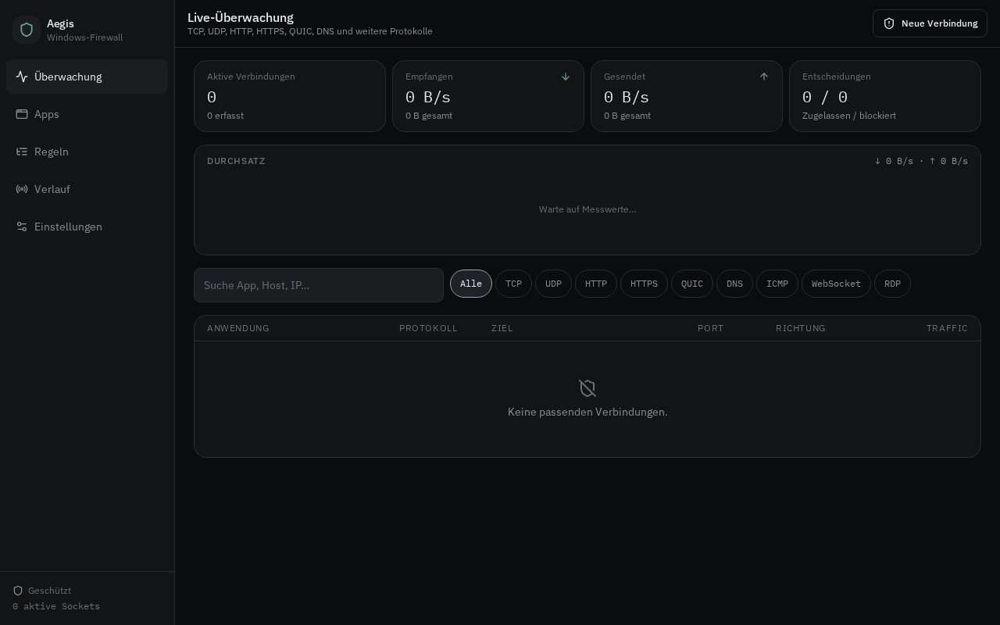
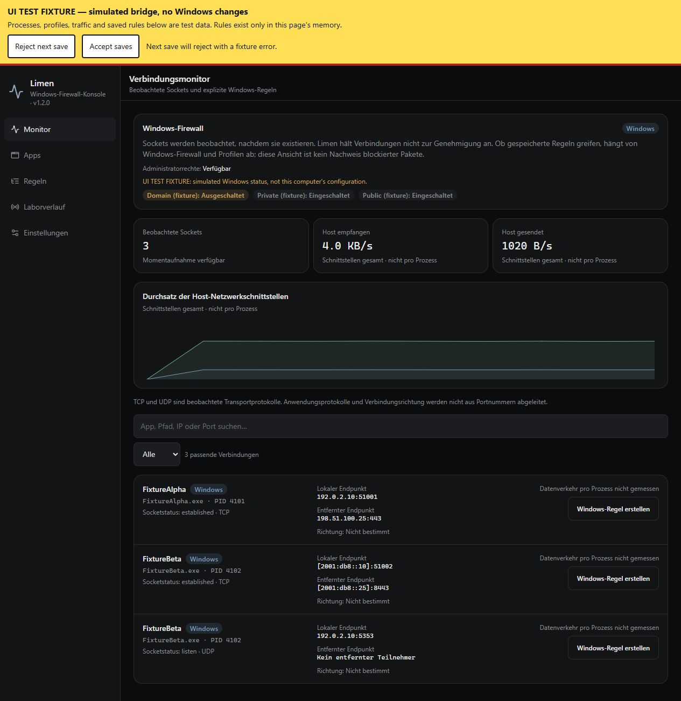

# Aegis

Windows-Firewall, die bei *ausgehenden* Verbindungen nachfragt. Version **1.1.0**.

Die eingebaute Windows-Firewall ist für Inbound ganz okay. Sobald Chrome, Discord oder irgendein Updater aus `%TEMP%` nach draußen will, passiert nichts. Kein Dialog, keine Chance. Aegis dreht das um.

Sobald eine App eine Verbindung aufbauen will, kommt das hier:

```
Google Chrome  ·  chrome.exe  ·  Google LLC (signiert)

versucht, eine Internetverbindung herzustellen.

Ziel        www.google.com
IP          142.250.185.46
Protokoll   HTTPS
Port        443
Richtung    Ausgehend

Regel gilt für:  Diesmal  |  App + Ziel  |  Gesamte App

[ Blockieren ]                    [ Zulassen ]
```

Genau das, was TinyWall / Little Snitch auf dem Mac machen. Nur halt als Konsole.

<p align="center">
  
</p>

## 1.1 — was neu ist

Ab 1.1 liest Aegis die Sockettabelle direkt aus dem Kernel. `/proc/net/tcp`, `tcp6`, `udp`, `udp6`. Inodes werden über die Filedeskriptoren der Prozesse auf PID und Binary gelegt. Der Durchsatz kommt von `/proc/net/dev`. Ohne das ist eine Firewall nur ein schönes Panel.

Unbekannte Remote-Sockets ohne Regel gehen durch denselben Dialog. Loopback und Listen-Ports siehst du in der Tabelle, sie nerven dich aber nicht. node, Vite und der Preview-Proxy sind vorab erlaubt — sonst legt die Konsole sich selbst lahm.

Acht Sprachen dazu, die weltweit am häufigsten gesprochen werden: English, 中文, हिन्दी, Español, Français, العربية, বাংলা, Português. Deutsch bleibt Default. Arabisch klappt das Layout um (RTL). Umschalten unter Einstellungen, bleibt gespeichert.

Das Windows-Labor (Chrome, Discord, …) ist noch da, aber aus. Anschalten, wenn du den Dialog ohne echten Socket testen willst.

Was sich an der Nummer geändert hat, steht in [CHANGELOG.md](CHANGELOG.md). Wie Versionen laufen: [docs/VERSIONING.md](docs/VERSIONING.md). Unter Einstellungen dieselbe Liste nochmal, ohne Markdown.

## Was es kann

Live-Tabelle mit Prozess, PID, Protokoll, Host, IP, Port, Richtung, Kernel/Labor und Durchsatz. Filter für TCP, UDP, HTTP, HTTPS, QUIC, DNS, ICMP, WebSocket, RDP.

Unbekannte Apps landen im Dialog. Systemkram und die eigene Runtime sind vorab erlaubt, sonst klickst du dich tot.

Unsignierte Binaries und eingehendes RDP kriegen eine Warnung. Macht Sinn — `pcopt-svc.exe` aus dem Temp-Ordner sollte man nicht aus Gewohnheit durchwinken.

Regeln halten in `localStorage`. Pro App, oder App plus Host. Lässt sich nachträglich an- und ausschalten.

Einstellungen: Firewall an/aus, Kernel-Capture, Labor, Sprache, Standard Nachfragen / Sperren / Zulassen. Eingehend extra, weil RDP auf 3389 was anderes ist als Chrome auf 443.

<p align="center">
  
</p>

## Was es nicht ist

Kein WFP-Treiber, kein `netsh advfirewall`. Blocken setzt die Richtlinie in der Konsole. Pakete auf dem Adapter droppen geht hier nicht — dafür bräuchte es nft/iptables im Userspace oder einen Filtertreiber auf Windows. Beides liegt in dieser Umgebung nicht. Die Überwachung ist echt. Das Droppen nicht. Das steht auch unter Einstellungen, nicht erst hier im Kleingedruckten.

## Start

Node 22.

```sh
npm i
npm run dev
```

Danach im Browser auf. Die Tabelle füllt sich aus der Kernel-Tabelle. Über **Neue Verbindung** erzwingst du den Dialog mit einer Labor-App, unabhängig davon ob das Labor sonst läuft.

Build:

```sh
npm run build
```

## Ordner

```
src/lib/firewall/            Katalog, Engine, Store, Kernel-Reader
src/lib/firewall/kernel-read.server.ts
                             /proc/net Parser, inode → PID
src/lib/i18n/                9 Sprachen
src/lib/version.ts           APP_VERSION + Release-Notizen
src/components/firewall/     Dialog, Monitor, Apps, Regeln, Verlauf
CHANGELOG.md                 was sich pro Version geändert hat
docs/VERSIONING.md           wie Nummern vergeben werden
```

`kernel-read.server.ts` liest die Tabellen. `engine.ts` pollt einmal pro Sekunde und schiebt neue Sockets in den Dialog. `store.ts` ist Zustand + Persistenz.

## Hinweise

Default-Sprache ist Deutsch. Regeln überleben einen Reload, der Verlauf nicht — der ist Session-Kram.

Wenn der Dialog nervt: Einstellungen → Standardrichtlinie auf Zulassen. Dann greifen nur noch explizite Block-Regeln. Umgekehrt Sperren, wenn du Default-Deny willst.

Nächstes größeres Upgrade wäre 1.2, nicht ein stilles 1.1.1. So bleibt nachvollziehbar, wann die Capture-Logik sich geändert hat.

## Lizenz

MIT. Mach damit, was du willst.
