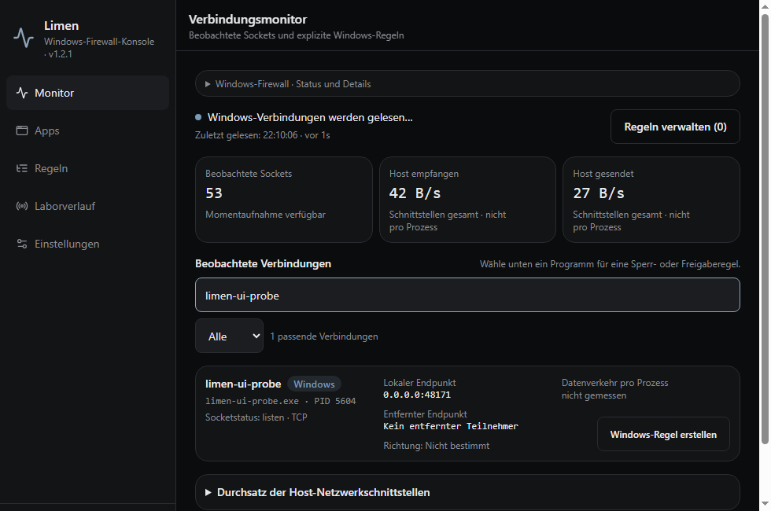

# Limen

**See Windows connections. Create real Windows Firewall rules for the programs you choose.**

Limen **1.2.1** is an early Windows desktop application built with Electron. It reads Windows TCP connections and UDP endpoints and manages its own program rules through Windows Defender Firewall. The old 1.1 web console could only simulate blocking; this release writes rules to Windows and reads their saved fields and active-policy status back. Successful storage does not guarantee that traffic is blocked; see the [validation record](docs/VALIDATION.md).



The screenshot is the installed Windows application in the test VM, filtered to the isolated test program. Its interface counters reflect real VM traffic. See the [validation record](docs/VALIDATION.md) for the UI and packet tests.

[Windows downloads](https://github.com/DataProtector-collab/limen-firewall/releases/tag/v1.2.1) · [How it works](#how-it-works) · [Build from source](#build-from-source) · [Changes](CHANGELOG.md)

## Install on Windows

Use Windows 10/11 **x64**, with Windows PowerShell 5.1, the NetSecurity module, and Windows Defender Firewall available.

1. Download **Limen-1.2.1-setup-x64.exe** for installation, or **Limen-1.2.1-portable-x64.exe** for the portable app.
2. Starting the desktop app requests administrator privileges for Windows Firewall rule management. Without elevation, rule changes are unavailable.
3. Open **Monitor** or **Apps** to inspect observed programs. Create an explicit inbound or outbound rule for a program, optionally limited to a literal remote IP, TCP/UDP, and local or remote port.
4. Use **Rules** to inspect, disable, or remove rules created by Limen.

The initial release is **unsigned**. Verify the release SHA-256 checksums and use source builds if you need to inspect the application before running it. It is not a replacement for your organization's endpoint protection.

## How it works

| Capability | Behavior |
| --- | --- |
| Windows capture | `Get-NetTCPConnection`, `Get-NetUDPEndpoint`, process paths, and `Get-NetAdapterStatistics` byte counters. If adapter statistics are empty, invalid, or unavailable, Limen falls back to .NET `NetworkInterface.GetIPStatistics()` for configured active interfaces. |
| Blocking and allowing | Explicit program rules in Windows Defender Firewall, created through `New-NetFirewallRule`. Changes are read back from Windows before the UI reports success. |
| Rule scope | A local `.exe` path, explicit inbound/outbound direction, optional literal remote IP, and either all protocols or TCP/UDP with optional local and remote ports. An IP rule is not a domain-name rule. |
| Persistence | Native rules remain stored when Limen closes. Windows enforces them while the matching policy and filtering category are active. Limen reads their state at startup. |
| Isolation | Local renderer files and a restricted Electron IPC bridge. No privileged HTTP server, account, cloud database, or remote web UI. |
| Browser preview | An explicitly labeled simulation lab. It cannot inspect the visitor's computer or change Windows Firewall. |

**This is not a first-packet interception firewall.** Limen observes sockets after Windows has created them. A connection may already have sent traffic before you create a rule. Its dialogs do not suspend packets, and it does not install a Windows Filtering Platform callout driver or enable global default-deny.

Windows Firewall decides the final outcome. Explicit block rules take precedence over conflicting allow rules. Existing rules, disabled profiles, group policy, and other security products can affect enforcement. Limen reports its backend and profile status and does not disable Windows Firewall or rewrite system-wide profile defaults. See Microsoft's [rule precedence documentation](https://learn.microsoft.com/en-us/windows/security/operating-system-security/network-security/windows-firewall/rules).

Limen displays the rule's **ActiveStore** status. A stored rule reported as `Inactive / CategoryDisabled` is not treated as effective protection. This occurred on the development machine; see the [validation record](docs/VALIDATION.md) before relying on this early release.

## What the monitor can tell you

- Real TCP states and bound UDP endpoints, process IDs, and executable paths when Windows permits access. The socket count includes listening, bound, and closing endpoints; it is not a count of programs currently transferring data.
- Traffic rates from two comparable adapter-counter readings. The first reading establishes a baseline; unavailable counters do not appear as zero traffic. Per-program traffic and dropped-packet counts are **not measured** and are not fabricated.
- UDP endpoint enumeration does not supply a remote peer. TCP socket enumeration also does not reliably identify connection direction; unknown values stay unknown.
- A binary's signature is not assumed from its name or path. Unchecked signatures remain unknown.
- Capture is periodic. The monitor shows the last successful read and whether another read is pending. After 15 seconds without a fresh snapshot, retained observations are labeled stale and traffic rates are withheld. Very short connections can be missed; inaccessible process paths and failed reads are reported rather than replaced with mock data.

Version 1.2.1 fixes a reproduced false-zero counter result on Windows. Failed counter reads preserve valid socket observations, and changes to the counter provider or adapter set require a fresh rate baseline. Connections and rule actions appear before the optional throughput chart. New rules default to the whole program; restricting a rule to one remote IP is an explicit choice shown in the scope summary before saving.

The optional simulation lab keeps its traffic and policies separate from Windows rules. Old browser-local rules are never silently installed into Windows.

## Build from source

Use **Node.js 22.12 or newer** and npm. Windows is required to run and package the native backend.

```sh
git clone https://github.com/DataProtector-collab/limen-firewall.git
cd limen-firewall
npm ci
npm test
npm run typecheck
npm run build
npm start
```

For native rule changes, start your development terminal as administrator. The packaged application requests elevation itself.

```sh
npm run dist:win
```

The portable executable and installer are written to `release/`. You can inspect the unpacked build with `npm run pack:win`.

For browser-only interface development:

```sh
npm run dev
```

This serves the lab at `http://127.0.0.1:8080`; `npm run preview` serves the production browser build at `http://127.0.0.1:8081`.

## Safety and testing

[SECURITY.md](SECURITY.md) documents the privilege boundary and limitations. [docs/VALIDATION.md](docs/VALIDATION.md) records the checks performed for this release and distinguishes automated regression tests from native enforcement tests.

Closing or uninstalling Limen does **not** remove its persistent Windows rules. Review and remove unwanted Limen rules before uninstalling, or use Windows Defender Firewall with Advanced Security to find the Limen rule group. Limen does not manage other applications' rules.

## Project layout

```text
desktop/                  Electron main/preload, Windows backend, native tests
src/lib/firewall/         Capture adapter, validated state, lab engine, tests
src/components/firewall/  Monitor, programs, native/lab rules, settings, dialogs
src/lib/i18n/             German/English text and legacy locale fallbacks
docs/                    Screenshots and validation notes
```

The desktop entry is `src/main.tsx`; obsolete web-server, account, database and deployment scaffolding has been removed. The current interface is translated into English and German. The seven other saved language selections currently display English; the language picker states this explicitly.

## License

[MIT](LICENSE). Copyright 2026 DataProtector-collab.
